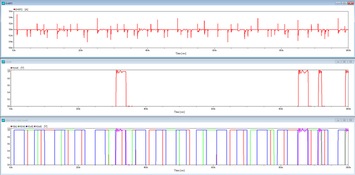

# SPICE simulation

Page is better to be viewed in "light" background.

The spice simulation is done with [AIM-Spice](http://www.aimspice.com/). In order to simulate with the files in this folder, one needs to understand the AIM-Spice.

## Circuit design

Files included in this implementation:

- andsub.txt, this describes the AIM syntax for the AND gate.
- andtest.cir, this is the testing file for the AND gate.
- bc.cir, this is the bit cell simulation file.
- inverstersub.txt, this describes the AIM syntax for the inverter.
- invertertest.cir, this is the testing file for the inverter.
- norsub.txt, this describes the AIM syntax for NOR gate.
- nortest.cir, this is the bit cell simulation file for the NOR gate.

## Sample plot

