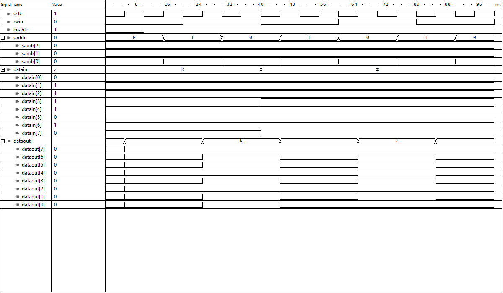

# Verilog implementation for the 8 bit RAM

Page is better to be viewed in "light" background.

The Verilog implementation is done in structural model, down to the transistor level. The tool used for this implementation is [Active-HDL Student Edition - FPGA Simulation](https://www.aldec.com/en/products/fpga_simulation/active_hdl_student).

## Circuits design

Files included in this implementation:

- bc.v, the bit cell structural model.
- bt.v, the byte circuit structural model, which consists of 8 bit cells as a row.
- decoder.v, the 3 to 8 decoder structural model.
- dflipflop.v, the D flipflop structural model.
- ram.v, the RAM circuit structural model.
-state.awc, the state simulation rules, which is minimum setup that includes only 2 states.
- state.v, the state machine circuit.

## Wave diagram simulation

The wave diagram shows write and read states for my name initials 'k' and 'z'.

