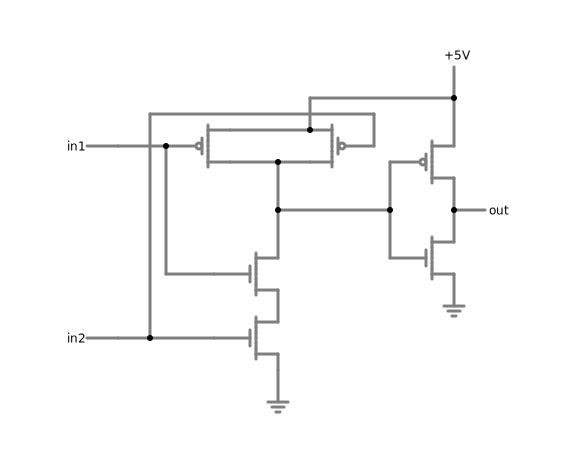

### 8 bit RAM circuit design and simulation

## How to start the simulation
- step 1: open page [circuit simulation](https://www.falstad.com/circuit)

- step 2: click on "File (on the top left corner) -> Import From Text..."

- step 3: copy one of the contents of the txt files in this folder.

- step 4: run the simulation.

## Screenshots

### RAM circuit

### Bit cell circuit

### 3-8 decoder circuit

### AND gate

